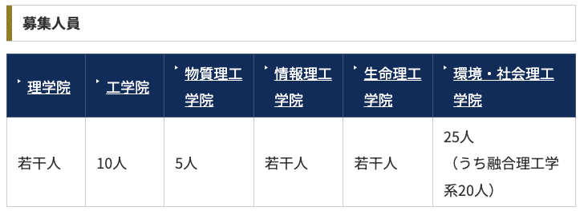
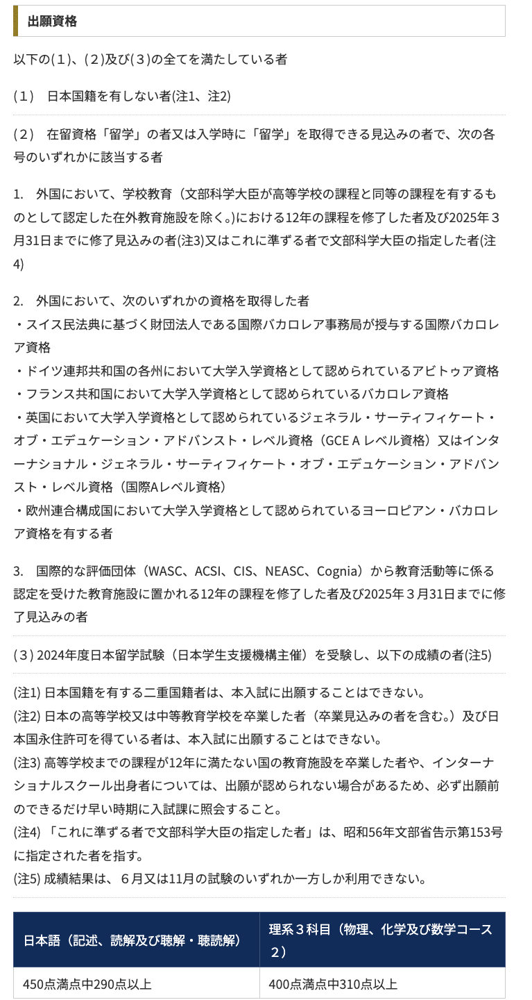
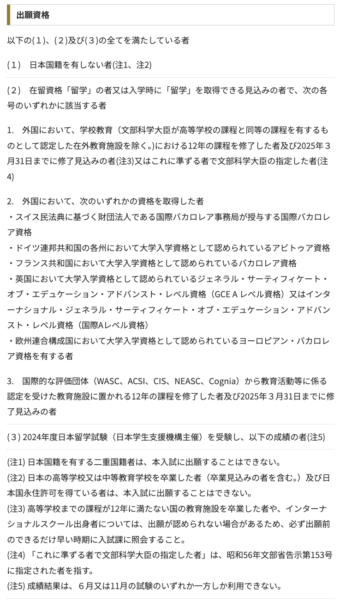
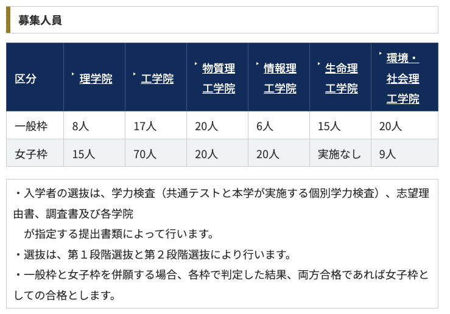
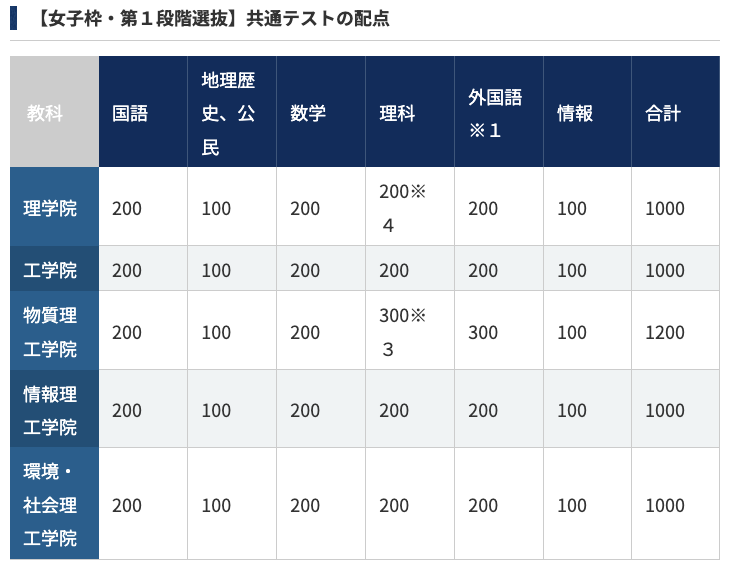
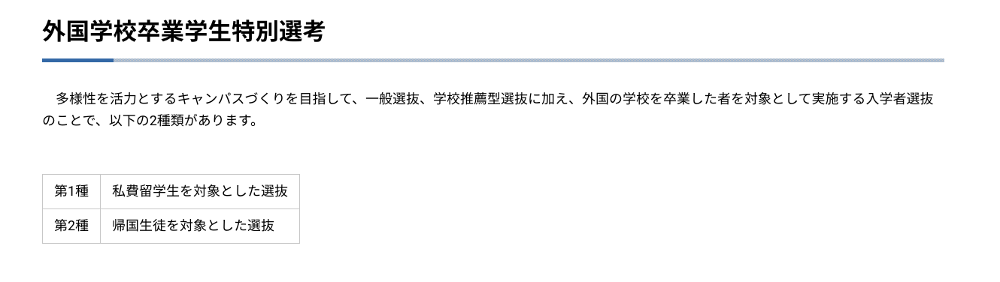
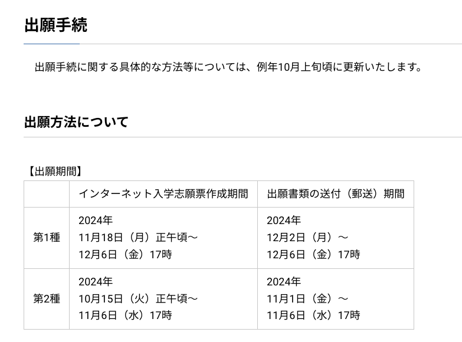

# 東京工業大学
https://admissions.titech.ac.jp/admission

## 私費外国人留学生特別選抜

https://admissions.titech.ac.jp/admissions/admission/admission/international

令和７（2025）年度入試の募集要項等（閲覧用PDF）
https://admissions.titech.ac.jp/admissions/admission/admission/international#:~:text=%E4%BB%A4%E5%92%8C%EF%BC%97%EF%BC%882025%EF%BC%89%E5%B9%B4%E5%BA%A6%E5%85%A5%E8%A9%A6%E3%81%AE%E5%8B%9F%E9%9B%86%E8%A6%81%E9%A0%85%E7%AD%89%EF%BC%88%E9%96%B2%E8%A6%A7%E7%94%A8PDF%EF%BC%89

## 国費外国人留学生優先配置選抜（GSEP）
https://admissions.titech.ac.jp/admissions/admission/admission/gsep

  ## 総合型選抜
https://admissions.titech.ac.jp/admissions/admission/admission/ao

  

  

# 東京大学
https://www.u-tokyo.ac.jp/ja/admissions/index.html

## 外国学校卒業学生特別選考
第1種：私費留学生・第2種：帰国生徒

https://www.u-tokyo.ac.jp/ja/admissions/undergraduate/e01_02_04.html

募集要項
https://www.u-tokyo.ac.jp/content/400244541.pdf

出願方法

## PEAK(九月)
https://peak.c.u-tokyo.ac.jp/

入試要項
https://peak.c.u-tokyo.ac.jp/apply/admissiondownloads/index.html

Application Guidelines for September 2025 Enrollment
(Please read carefully before applying)
https://peak.c.u-tokyo.ac.jp/vcms_lf/ApplicationGuidelines_2025.pdf

Certificate of (Expected) Graduation Format
(If your school does not have the certificate format, please use this format)
https://peak.c.u-tokyo.ac.jp/vcms_lf/CertificateofGraduationForm.pdf

奨学金
https://peak.c.u-tokyo.ac.jp/fees_scholarships/l3/Vcms3_00000232.html

9/4の説明会
https://forms.office.com/pages/responsepage.aspx?id=T6978HAr10eaAgh1yvlMhBJLRhvhDj9Jg8WOxelQgjlUOEM1T0dTNjc0UkNHRzlBNFY5SEw5NkVXNCQlQCN0PWcu

https://peak.c.u-tokyo.ac.jp/topics/l3/Infoseminar_2024.html

